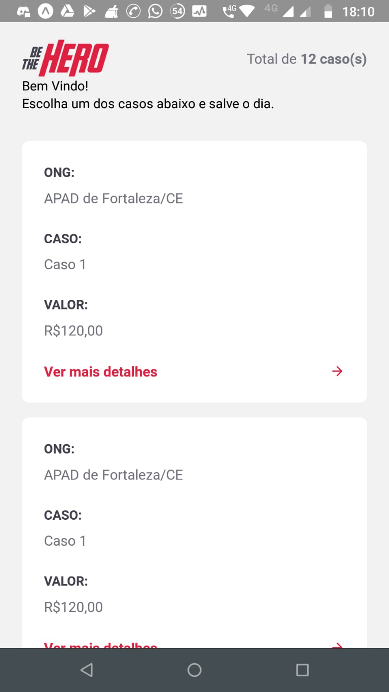
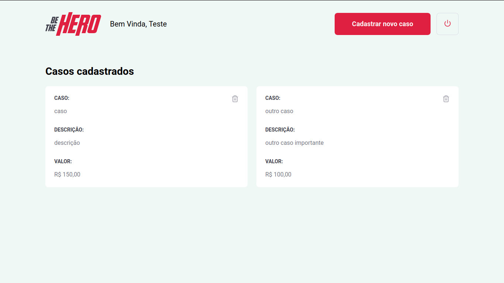

<h1 align="center">
    
</h1>

<h1 align="center">
  Be The Hero
</h1>

 

<h3 align="center">
  Mobile
</h3>

  

<h3 align="center">
  Frontend
</h3>

  

## :rocket: Tecnologias

Esse projeto foi desenvolvido com as seguintes tecnologias:

- [Node.js](https://nodejs.org/en/)
- [React](https://reactjs.org)
- [React Native](https://facebook.github.io/react-native/)
- [Expo](https://expo.io/)

## 💻 Projeto

O Be The Hero é um projeto que visa aproximar o usuário de ONGs que precisam de ajuda (doações) em certos casos. O Contato pode ser feito através de E-mail ou Whatsapp.

## 🤔 Como contribuir

- Faça um fork desse repositório;
- Cria uma branch com a sua feature: `git checkout -b minha-feature`;
- Faça commit das suas alterações: `git commit -m 'feat: Minha nova feature'`;
- Faça push para a sua branch: `git push origin minha-feature`.

Depois que o merge da sua pull request for feito, você pode deletar a sua branch.

## :memo: Licença

Esse projeto está sob a licença MIT. Veja o arquivo [LICENSE](LICENSE.md) para mais detalhes.

---

Feito com ♥ by Diego Araujo :wave: [Entre em contato!](https://www.linkedin.com/in/diegooliveiradearaujo/)
